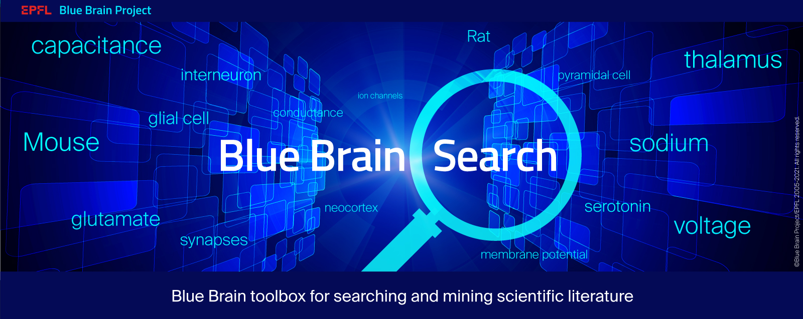
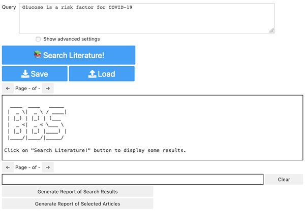
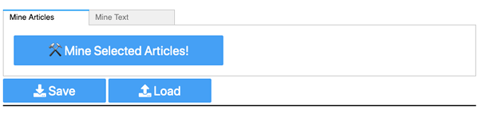
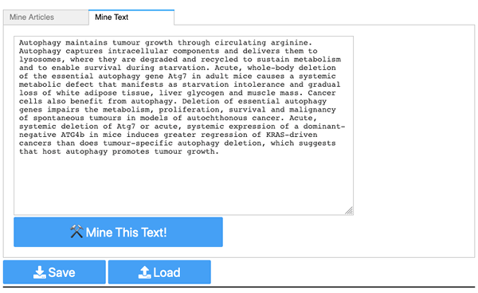

<!---
Blue Brain Search is a text mining toolbox focused on scientific use cases.

Copyright (C) 2020  Blue Brain Project, EPFL.

This program is free software: you can redistribute it and/or modify
it under the terms of the GNU Lesser General Public License as published by
the Free Software Foundation, either version 3 of the License, or
(at your option) any later version.

This program is distributed in the hope that it will be useful,
but WITHOUT ANY WARRANTY; without even the implied warranty of
MERCHANTABILITY or FITNESS FOR A PARTICULAR PURPOSE.  See the
GNU Lesser General Public License for more details.

You should have received a copy of the GNU Lesser General Public License
along with this program. If not, see <https://www.gnu.org/licenses/>.
-->


# Blue Brain Search

<table>
<tr>
  <td>Source Code DOI</td>
  <td>
    <a href="https://doi.org/10.5281/zenodo.4563998">
    
    </a>
  </td>
</tr>
<tr>
  <td>Data & Models DOI</td>
  <td>
    <a href="https://doi.org/10.5281/zenodo.4589006">
    
    </a>
  </td>
</tr>
<tr>
    <td>Documentation</td>
    <td>
        <a href="https://blue-brain-search.readthedocs.io/en/stable/">
        
        </a>
    </td>
</tr>
<tr>
  <td>Latest Release</td>
  <td>
        <a href="https://pypi.org/project/bluesearch/">
        
        </a>
  </td>
</tr>
<tr>
  <td>Python Versions</td>
  <td>
    
    </a>
  </td>
</tr>
<tr>
  <td>License</td>
  <td>
    <a href="https://github.com/BlueBrain/Search/blob/master/COPYING.LESSER">
    
    </a>
</td>
</tr>
<tr>
  <td>Build Status</td>
  <td>
    <a href="https://github.com/BlueBrain/Search/actions?query=workflow%3A%22ci+testing%22+branch%3Amaster">
    
    </a>
  </td>
</tr>
<tr>
	<td>Static Typing</td>
	<td>
		<a href="http://mypy-lang.org/">
		
		</a>
	</td>
</tr>
<tr>
	<td>Code Style</td>
	<td>
		<a href="https://github.com/psf/black">
		
		</a>
		<a href="https://pycqa.github.io/isort/">
		
		</a>
		<a href="http://www.pydocstyle.org/">
		
		</a>
		<a href="https://flake8.pycqa.org/">
		
		</a>
	</td>
</tr>
<tr>
	<td>Security</td>
	<td>
		<a href="https://github.com/PyCQA/bandit">
		
		</a>
	</td>
</tr>
</table>

Blue Brain Search is a text mining toolbox to perform semantic literature search
and structured information extraction from text sources.

This repository originated from the Blue Brain Project efforts on exploring and
mining the [CORD-19 dataset](https://www.kaggle.com/allen-institute-for-ai/CORD-19-research-challenge).


## Graphical Interface

The graphical interface is composed of [widgets](https://github.com/jupyter-widgets/ipywidgets)
to be used in [Jupyter notebooks](https://github.com/jupyterlab/jupyterlab).

For the graphical interface to work, the steps of the [Getting Started](#getting-started)
should have been completed successfully.

### Find documents based on sentence semantic similarity

<p align="center">
  
</p>

To find sentences semantically similar to the query *'Glucose is a risk factor
for COVID-19'* in the documents, you could just click on the blue button named
`Search Literature!`. You could also enter the query of your choice by editing
the text in the top field named `Query`. 

The returned results are ranked by decreasing semantic similarity. This means
that the first results have a similar meaning to the query. Thanks to the
state-of-the-art approach based on deep learning used by Blue Brain Search,
this is true even if the query and the sentences from the documents do not
share the same words (e.g. they are synonyms, they have a similar meaning, ...).

### Extract structured information from documents

The extraction could be done either on documents found by the search above or
on the text content of a document pasted in the widget.

#### Found documents

<p align="center">
  
</p>

To extract structured information from the found documents, you could just
click on the blue button named `Mine Selected Articles!`.

At the moment, the returned results are named entities. For each named entity,
the structured information is: the mention (e.g. 'COVID-19'), the type
(e.g. 'DISEASE'), and its location up to the character in the document.


#### Pasted document content

<p align="center">
  
</p>

It is also possible to extract structured information from the pasted
content of a document. To switch to this mode, you could just click on the
tab named `Mine Text`. Then, you could launch the extraction by just clicking 
on the blue button named `Mine This Text!`. You could also enter the content
of your choice by editing the text field.

## Getting Started

There are 8 steps which need to be done in the following order:

0. [Prerequisites](#prerequisites)
1. [Retrieve the documents](#retrieve-the-documents)
2. [Initialize the database server](#initialize-the-database-server)
3. [Install Blue Brain Search](#install-blue-brain-search)
4. [Create the database](#create-the-database)
5. [Compute the sentence embeddings](#compute-the-sentence-embeddings)
6. [Create the mining cache](#create-the-mining-cache)
7. [Initialize the search, mining, and notebook servers](#initialize-the-search-mining-and-notebook-servers)
8. [Open the example notebook](#open-the-example-notebook)

Before proceeding, four things need to be noted.

First, these instructions are to reproduce the environment and results of
Blue Brain Search v0.1.0. Indeed, this is the version for which the models we
have trained have been publicly released.

Second, the setup of Blue Brain Search requires the launch of 4 servers
(database, search, mining, notebook). The instructions are supposed to be
executed on a powerful remote machine and the notebooks are supposed to be
accessed from a personal local machine through the network.

Third, the ports, the Docker image names, and the Docker container names are
modified (see below) to safely test the instructions on a machine where the
Docker images would have already been built, the Docker containers would
already run, and the servers would already run.

Fourth, if you are in a production setting, the database password and the
notebook server token should be changed, the prefix `test_` should be removed
from the Docker image and container names, the `sed` commands should be
omitted, and the second digit of the ports should be replaced by `8`.

### Prerequisites

The instructions are written for GNU/Linux machines. However, any machine
with the equivalent of `git`, `wget`, `tar`, `cd`, `mv`, `mkdir`, `sed`
(optional), and `echo` could be used.

The software named `Docker` is also needed. To install `Docker`, please refer 
to the [official Docker documentation](https://docs.`docker.com/engine/install/).

An optional part is using the programming language `Python` and its package
manager `pip`. To install `Python` and `pip` please refer to the
[official Python documentation](https://wiki.python.org/moin/BeginnersGuide/Download).

Otherwise, let's start in a newly created directory.

First, download the snapshot of the DVC remote and extract it.

```bash
wget https://zenodo.org/record/4589007/files/bbs_dvc_remote.tar.gz
tar xf bbs_dvc_remote.tar.gz
```

Second, clone the Blue Brain Search repository for v0.1.0.

```bash
git clone --depth 1 --branch v0.1.0 https://github.com/BlueBrain/Search.git
```

Third, keep track of the path to the working directory, the repository
directory, and the data and models directory.

```bash
export WORKING_DIRECTORY="$(pwd)"
export REPOSITORY_DIRECTORY="$WORKING_DIRECTORY/Search"
export BBS_DATA_AND_MODELS_DIR="$REPOSITORY_DIRECTORY/data_and_models"
```

Finally, define the configuration common to all the instructions.

```bash
export DATABASE_PORT=8953
export SEARCH_PORT=8950
export MINING_PORT=8952
export NOTEBOOK_PORT=8954

export DATABASE_PASSWORD=1234
export NOTEBOOK_TOKEN=1a2b3c4d

export USER_NAME=$(id -un)
export USER_ID=$(id -u)

export http_proxy=http://bbpproxy.epfl.ch:80/
export https_proxy=http://bbpproxy.epfl.ch:80/
```

### Retrieve the documents

This will download and decompress the CORD-19 version corresponding to the
version 73 on Kaggle. Note that the data are around 7 GB. Decompression would
take around 3 minutes.

```bash
export CORD19_VERSION=2021-01-03
export CORD19_ARCHIVE=cord-19_${CORD19_VERSION}.tar.gz
export CORD19_DIRECTORY=$WORKING_DIRECTORY/$CORD19_VERSION
```

```bash
cd $WORKING_DIRECTORY
wget https://ai2-semanticscholar-cord-19.s3-us-west-2.amazonaws.com/historical_releases/$CORD19_ARCHIVE
tar xf $CORD19_ARCHIVE
```

```bash
cd $CORD19_DIRECTORY
tar xf document_parses.tar.gz
```

CORD-19 contains more than 400,000 publications. The next sections could run
for several hours, even days, depending on the power of the machine.

For testing purposes, you might want to consider a subset of the CORD-19. The
following code select around 1,400 articles about *glucose* and *risk factors*:

```bash
mv metadata.csv metadata.csv.original
pip install pandas
python
```

```python
import pandas as pd
metadata = pd.read_csv('metadata.csv.original')
sample = metadata[
    metadata.title.str.contains('glucose', na=False)
    | metadata.title.str.contains('risk factor', na=False)
  ]
print('The subset contains', sample.shape[0], 'articles.')
sample.to_csv('metadata.csv', index=False)
exit()
```

### Initialize the database server

```bash
export DATABASE_NAME=cord19
export DATABASE_URL=$HOSTNAME:$DATABASE_PORT/$DATABASE_NAME
```

This will build a Docker image where MySQL is installed.

```bash
cd $REPOSITORY_DIRECTORY
docker build \
  --build-arg http_proxy \
  --build-arg https_proxy  \
  -f docker/mysql.Dockerfile -t test_bbs_mysql .
```

NB:`HTTP_PROXY` and `HTTPS_PROXY`, in upper case, are not working here.

This will launch using this image a MySQL server running in a Docker container.

```bash
docker run \
  --publish $DATABASE_PORT:3306 \
  --env MYSQL_ROOT_PASSWORD=$DATABASE_PASSWORD \
  --detach \
  --name test_bbs_mysql test_bbs_mysql
```

You will be asked to enter the MySQL root password defined above
(`DATABASE_PASSWORD`).

```bash
docker exec --interactive --tty test_bbs_mysql bash
mysql -u root -p
```

Please replace `<database name>` by the value of `DATABASE_NAME`.

```sql
CREATE DATABASE <database name>;
CREATE USER 'guest'@'%' IDENTIFIED WITH mysql_native_password BY 'guest';
GRANT SELECT ON <database name>.* TO 'guest'@'%';
exit;
```

Please exit the interactive session on the `test_bbs_mysql` container.

```bash
exit
```

### Install Blue Brain Search

This will build a Docker image where Blue Brain Search is installed.

```bash
cd $REPOSITORY_DIRECTORY
docker build \
  --build-arg BBS_HTTP_PROXY=$http_proxy \
  --build-arg BBS_http_proxy=$http_proxy \
  --build-arg BBS_HTTPS_PROXY=$https_proxy \
  --build-arg BBS_https_proxy=$https_proxy \
  --build-arg BBS_USERS="$USER_NAME/$USER_ID" \
  -f docker/base.Dockerfile -t test_bbs_base .
```

NB: At the moment, `HTTP_PROXY`, `HTTPS_PROXY`, `http_proxy`, and `https_proxy`
are not working here.

This will launch using this image an interactive session in a Docker container.

The immediate next sections will need to be run in this session.

```bash
docker run \
  --volume /raid:/raid \
  --env REPOSITORY_DIRECTORY \
  --env CORD19_DIRECTORY \
  --env WORKING_DIRECTORY \
  --env DATABASE_URL \
  --env BBS_DATA_AND_MODELS_DIR \
  --gpus all \
  --interactive \
  --tty \
  --rm \
  --user "$USER_NAME" \
  --name test_bbs_base test_bbs_base
```

```bash
cd $REPOSITORY_DIRECTORY
```

```bash
pip install .
```

Then, configure DVC to work with the downloaded snapshot of the DVC remote.

```bash
dvc remote add --default local $WORKING_DIRECTORY/bbs_dvc_remote
```

### Create the database

You will be asked to enter the MySQL root password defined above
(`DATABASE_PASSWORD`).

If you are using the CORD-19 subset of around 1,400 articles, this would take
around 3 minutes.

```bash
create_database \
  --cord-data-path $CORD19_DIRECTORY \
  --db-url $DATABASE_URL
```

### Compute the sentence embeddings

If you are using the CORD-19 subset of around 1,400 articles, this would take
around 2 minutes (on 2 Tesla V100 16 GB).

```bash
export EMBEDDING_MODEL='BioBERT NLI+STS CORD-19 v1'
export BBS_SEARCH_EMBEDDINGS_PATH=$WORKING_DIRECTORY/embeddings.h5
```

```bash
cd $BBS_DATA_AND_MODELS_DIR/models/sentence_embedding/
```

```bash
dvc pull biobert_nli_sts_cord19_v1
```

```bash
compute_embeddings SentTransformer $BBS_SEARCH_EMBEDDINGS_PATH \
  --checkpoint biobert_nli_sts_cord19_v1 \
  --db-url $DATABASE_URL \
  --gpus 0,1 \
  --h5-dataset-name "$EMBEDDING_MODEL" \
  --n-processes 2
```

NB: At the moment, `compute_embeddings` handles more models than the search
server. The supported models for the search could be found in
`SearchServer._get_model(...)`.

### Create the mining cache

```bash
cd $BBS_DATA_AND_MODELS_DIR/pipelines/ner/
dvc pull $(< dvc.yaml grep -oE '\badd_er_[0-9]+\b' | xargs)
```

You will be asked to enter the MySQL root password defined above
(`DATABASE_PASSWORD`).

If you are using the CORD-19 subset of around 1,400 articles, this would take
around 4 minutes.

```bash
cd $REPOSITORY_DIRECTORY
create_mining_cache \
  --db-url $DATABASE_URL \
  --target-table-name=mining_cache
```

NB: By default, the logging level is set to show the `INFO` logs. Note also that the command `cd
$REPOSITORY_DIRECTORY` above is essential as otherwise the mining models will not be
found.

### Initialize the search, mining, and notebook servers

Please exit the interactive session of the `test_bbs_base` container.

```bash
exit
```

```bash
cd $REPOSITORY_DIRECTORY
```

#### Search server

```bash
sed -i 's/ bbs_/ test_bbs_/g' docker/search.Dockerfile
docker build \
  -f docker/search.Dockerfile -t test_bbs_search .
```

Please export also in this environment the variables `EMBEDDING_MODEL` and
`BBS_SEARCH_EMBEDDINGS_PATH`.

```bash
export BBS_SEARCH_DB_URL=$DATABASE_URL
export BBS_SEARCH_MYSQL_USER=guest
export BBS_SEARCH_MYSQL_PASSWORD=guest

export BBS_SEARCH_MODELS_PATH=$BBS_DATA_AND_MODELS_DIR/models/sentence_embedding/
export BBS_SEARCH_MODELS=$EMBEDDING_MODEL
```

```bash
docker run \
  --publish $SEARCH_PORT:8080 \
  --volume /raid:/raid \
  --env BBS_SEARCH_DB_URL \
  --env BBS_SEARCH_MYSQL_USER \
  --env BBS_SEARCH_MYSQL_PASSWORD \
  --env BBS_SEARCH_MODELS \
  --env BBS_SEARCH_MODELS_PATH \
  --env BBS_SEARCH_EMBEDDINGS_PATH \
  --detach \
  --name test_bbs_search test_bbs_search
```

#### Mining server

```bash
sed -i 's/ bbs_/ test_bbs_/g' docker/mining.Dockerfile
docker build \
  -f docker/mining.Dockerfile -t test_bbs_mining .
```

```bash
export BBS_MINING_DB_TYPE=mysql
export BBS_MINING_DB_URL=$DATABASE_URL
export BBS_MINING_MYSQL_USER=guest
export BBS_MINING_MYSQL_PASSWORD=guest
```

```bash
docker run \
  --publish $MINING_PORT:8080 \
  --volume /raid:/raid \
  --env BBS_MINING_DB_TYPE \
  --env BBS_MINING_DB_URL \
  --env BBS_MINING_MYSQL_USER \
  --env BBS_MINING_MYSQL_PASSWORD \
  --detach \
  --name test_bbs_mining test_bbs_mining
```

#### Notebook server

The structured information searched and extracted using the text mining tools provided by [Blue Brain Seach](https://github.com/BlueBrain/Search)
can be conveniently transformed and analyzed as a knowledge graph using the tools provided by [Blue Brain Graph](https://github.com/BlueBrain/BlueBrainGraph).

To use the complete pipeline—composed of literature search, text mining, and transformed into a knowledge graph-you
should use the proof of concept notebook [`BBS_BBG_poc.ipynb`](https://github.com/BlueBrain/Search-Graph-Examples/blob/master/BBS_BBG_poc.ipynb)
from [our dedicated repository](https://github.com/BlueBrain/Search-Graph-Examples.git).
In order to use such notebook, please follow the instructions from [the dedicated README](https://github.com/BlueBrain/Search-Graph-Examples#blue-brain-search-and-graph-examples).


If you want to setup the notebook in a docker container, please create an environment
variable called NOTEBOOK_DIRECTORY and launch the following command:

```bash
export NOTEBOOK_DIRECTORY="$WORKING_DIRECTORY/Search-Graph-Examples"
```

```bash
docker run \
  --publish $NOTEBOOK_PORT:8888 \
  --volume /raid:/raid \
  --env NOTEBOOK_TOKEN \
  --env DB_URL \
  --env SEARCH_ENGINE_URL \
  --env TEXT_MINING_URL \
  --interactive \
  --tty \
  --rm \
  --user "$USER_NAME" \
  --workdir $NOTEBOOK_DIRECTORY \
  --name test_bbs_notebook test_bbs_base
```

Do not hesitate to check Blue Brain Search-Graph-Examples repository
for any encountered issues linked to the notebook.

Please hit `CTRL+P` and then `CTRL+Q` to detach from the Docker container.

### Open the example notebook

```bash
echo http://$HOSTNAME:$NOTEBOOK_PORT/lab/tree/BBS_BBG_poc.ipynb?token=$NOTEBOOK_TOKEN
```

To open the example notebook, please open the link returned above in a browser.

*Voilà!* You could now use the graphical interface.

### Clean-up

Please note that this will **DELETE ALL** what was done in the previous
sections of this *Getting Started*. This could be useful to do so after having
tried the instructions or when something went bad.

```bash
export SERVERS='test_bbs_search test_bbs_mining test_bbs_mysql'
```

```bash
docker stop test_bbs_notebook $SERVERS
docker rm $SERVERS
docker rmi $SERVERS test_bbs_base
```

```bash
rm $BBS_SEARCH_EMBEDDINGS_PATH
rm -R $CORD19_DIRECTORY
rm $WORKING_DIRECTORY/$CORD19_ARCHIVE
rm -R $REPOSITORY_DIRECTORY
```

## Installation (virtual environment)
We currently support the following Python versions.
Make sure you are using one of them.
 - Python 3.7
 - Python 3.8
 - Python 3.9

Before installation, please make sure you have a recent `pip` installed (`>=19.1`)

```bash
pip install --upgrade pip
```

Then you can easily install `bluesearch` from PyPI:

```bash
pip install bluesearch
```

You can also build from source if you prefer:

```bash
pip install .
```

## Installation (Docker)
We provide a docker file, `docker/Dockerfile` that allows to build a docker
image with all dependencies of `bluesearch` pre-installed. Note that
`bluesearch` itself is not installed, which needs to be done manually
on each container that is spawned.

To build the docker image open a terminal in the root directory of the project
and run the following command.

```bash
$ docker build -f docker/Dockerfile -t bbs .
```

Then, to spawn an interactive container session run
```bash
$ docker run -it --rm bbs
```

## Documentation
We provide additional information on the package in the documentation. 
All the versions of our documentation, both stable and latest, [can be found 
on Read the Docs](https://blue-brain-search.readthedocs.io/en/stable/).

If you want to manually build the documentation, you can do so using
Sphinx. Make sure to install the `bluesearch` package with `dev`
extras to get the necessary dependencies.

```bash
pip install -e .[dev]
```


Then, to generate the documentation run

```bash
cd docs
make clean && make html
```

You can open the resulting documentation in a browser by navigating to `docs/_build/html/index.html`.

## Testing
We use `tox` to run all our tests. Running `tox` in the terminal will execute
the following environments:
- `lint`: code style and documentation checks
- `docs`: test doc build
- `check-packaging`: test packaging
- `py37`: run unit tests (using pytest) with python3.7
- `py38`: run unit tests (using pytest) with python3.8
- `py39`: run unit tests (using pytest) with python3.9

Each of these environments can be run separately using the following syntax:
```shell script
$ tox -e lint
```
This will only run the `lint` environment.

We provide several convenience tox environments that are not run automatically
and have to be triggered by hand:
- `format`
- `benchmarks`

The `format` environment will reformat all source code using `isort` and `black`.

The `benchmark` environment will run pre-defined pytest benchmarks. Currently
these benchmarks only test various servers and therefore need to know the server
URL. These can be passed to `tox` via the following environment variables:
```shell script
export EMBEDDING_SERVER=http://<url>:<port>
export MINING_SERVER=http://<url>:<port>
export MYSQL_SERVER=<url>:<port>
export SEARCH_SERVER=http://<url>:<port>
```
If a server URL is not defined, then the corresponding tests will be skipped.

It is also possible to provide additional positional arguments to pytest using
the following syntax:
```shell script
$ tox -e benchmarks -- <positional arguments>
```
for example:
```shell script
$ tox -e benchmarks -- \
  --benchmark-histogram=my_histograms/benchmarks \
  --benchmark-max-time=1.5 \
  --benchmark-min-rounds=1
```
See `pytest --help` for additional options.


### Funding & Acknowledgment
This project was supported by funding to the Blue Brain 
Project, a research center of the Ecole polytechnique fédérale de Lausanne, from 
the Swiss government's ETH Board of the Swiss Federal Institutes of Technology.

COPYRIGHT 2021, Blue Brain Project/EPFL
